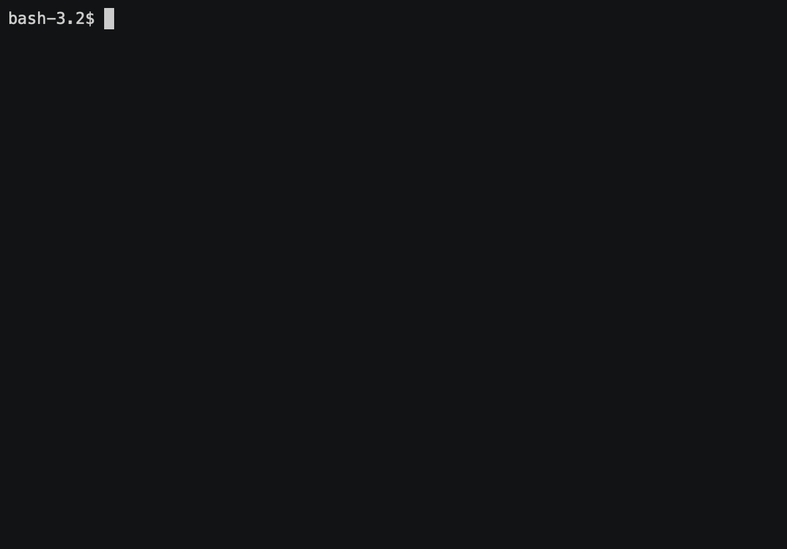

## Badges:

## Installation:
####composer global require artems/gendiff:dev-master

## Description:
####Cli program for find difference between two text files and form result. Program supports formats json and yaml. 

## Pretty json diff

## Pretty yaml diff

## Plain json diff

## Plain yaml diff

## Json json diff and yaml diff
